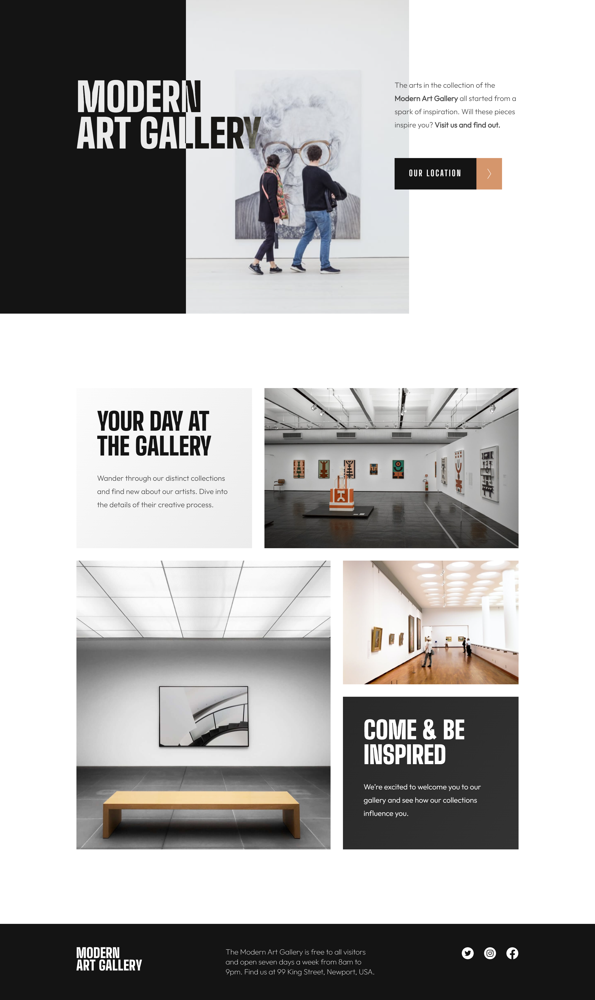

# Frontend Mentor - Art gallery website solution

This is a solution to the [Art gallery website challenge on Frontend Mentor]
## Table of contents

- [Overview](#overview)
  - [The challenge](#the-challenge)
  - [Screenshot](#screenshot)
  - [Links](#links)
- [My process](#my-process)
  - [Built with](#built-with)
  - [What I learned](#what-i-learned)

### Screenshot

### Links

- Solution URL: [Frontend Mentor Solution] []
- Live Site URL: (https://art-gallery-website-leenaramayyagari.netlify.app/)
## My process

### Built with

- Semantic HTML5 markup
- Flexbox
- Media queries
- Grid
- Responsive Design
- CSS Animations

### What I learned
I found this challenge to be quite demanding, perhaps one of the most challenging ones I've encountered so far. Additionally, I seized the chance to explore a JavaScript library for the first time, integrating maps using 'Leaflet.' It was an enriching experience, and I'm thrilled by the outcome of this remarkable challenge.

